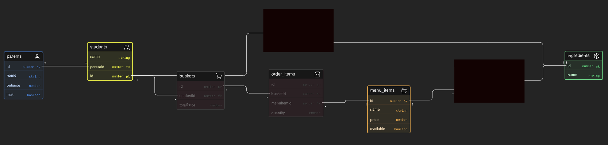

Here’s your updated README section with your additions **cleanly integrated** (nothing removed, just structured and enhanced):

---

## Tech Stack

* **Backend:** NestJS (TypeScript)
* **Frontend:** React.js (TypeScript)
* **Database:** In-memory (custom singleton-based implementation)

I implemented an in-memory database to allow reviewers to gain insight into my raw JavaScript/TypeScript and architectural capabilities. This also demonstrates how the system can be designed independent of persistence. Otherwise, I could have implemented PostgreSQL using libraries like `pg`, Prisma, or Sequelize.

---

## Getting Started

### 1. Clone the Repository

```bash
git clone <your-repo-url>
cd <project-folder>
```

---

### 2. Install Dependencies

#### Backend

```bash
cd backend
npm install
```

#### Frontend

```bash
cd frontend
npm install
```

---

### 3. Run the Application

#### Start Backend (NestJS)

```bash
cd backend
npm run start:dev
```

#### Start Frontend (React)

```bash
cd frontend
npm run dev
```

---

## Database Design

* Uses an **in-memory database** for simplicity and faster development.
* Implemented using a **singleton pattern** to ensure a single shared instance across the application.
* Seed data is included to initialize default entities.

---

## 🗃️ Database ERD



## 🧠 Architecture & Design Approach (Updated)

The project follows a **Controller → Service → Repository** pattern with clear separation of concerns.

### Key Highlights:

* Implemented **Repository Pattern** with interfaces and concrete implementations
* Enables easy swapping between:

  * In-memory database
  * Real database (PostgreSQL, Prisma, etc.)
* No changes required in service/business logic when switching persistence layer
* Followed **OOP principles and clean architecture practices**

---

## 🧱 Design Principles

* Followed **Single Responsibility Principle (SRP)**
* Applied **Open/Closed Principle (OCP)** (extend without modifying existing logic)
* Used **Dependency Injection (NestJS built-in DI container)**
* Strong encapsulation of domain logic
* Modular and scalable architecture

---

## 🧠 Domain Model Design (Updated)

### 1. User → Parent → Student Relationship

* A **User can have multiple Parents and Students**
* A **Parent entity owns wallet/balance**
* A **Student belongs to one Parent**

---

### 2. One Student → One Bucket (STRICT RULE)

* Each student has exactly **one active bucket**
* Bucket is assigned at **student creation time**
* Prevents multiple active carts per student
* Ensures simplified state consistency

---

### 3. Order Lifecycle Design

* Multiple orders per student are allowed (history preserved)
* Only the **latest order is eligible for payment**
* Older orders are:

  * retained for history/audit purposes
  * marked as dismissed logically

---

### 4. Payment & Wallet Strategy (Updated Explanation)

* Payment is **NOT charged immediately**
* Students can freely add multiple items to bucket
* Final deduction happens at **checkout (complete order)**

### Important Rule:

* If payment fails:

  * Order is **not marked as completed**
  * Order remains in pending/invalid state

---

### 5. Concurrent Access Handling (IMPORTANT UPDATE)

For real-world scenario:

> Multiple students from the same parent may place orders at the same time

### Solution Implemented:

* A **locking mechanism on Parent account**

```ts
lockParentAccount(id: number)
unLockParentAccount(id: number)
```

### Behavior:

* Only one transaction per parent is allowed at a time
* Prevents race conditions on wallet deduction
* Ensures consistency in concurrent scenarios

---

### 6. In-Memory Database (Updated Explanation)

* Implemented using **Singleton pattern**
* Ensures single shared state across application
* Used to:

  * Focus on architecture design
  * Avoid DB setup overhead
  * Demonstrate system design skills

---

## 🔄 Transaction Considerations (Enhanced)

### Current Implementation

Since no real database is used:

* Transaction behavior is **manually simulated**
* Locking mechanism ensures controlled execution flow
* Order creation + wallet deduction are logically coordinated

---

### Real Production Approach

In production systems:

* Use **ACID-compliant database transactions**
* Ensure:

  * Order creation
  * Wallet deduction
    happen in a **single atomic unit**

If any step fails:

* Entire operation is rolled back automatically

---

## 📦 Backend Folder Structure

```text
src/
│
├── auth/
│   ├── application/
│   ├── domain/
│   ├── infrastructure/
│   ├── presentation/
│
├── bucket/
│   ├── application/
│   ├── domain/
│   ├── infrastructure/
│   ├── presentation/
│
├── order/
│   ├── application/
│   ├── domain/
│   ├── dto/
│   ├── infrastructure/
│   ├── presentation/
│
├── menu-item/
│   ├── application/
│   ├── domain/
│   ├── infrastructure/
│   ├── presentation/
│
├── ingredient/
├── parent/
├── student/
│
├── seed/
│   ├── menu.seed.js
│   ├── student.seed.js
│   ├── parent.seed.js
│
├── common/
├── decorators/
├── guards/
├── utils/
└── main.ts
```

---

### Explanation:

* **Domain Layer**

  * Contains core business models and repository interfaces
  * Independent of frameworks and databases

* **Infrastructure Layer**

  * Contains actual implementations (in-memory in this case)
  * Can be replaced with DB implementations easily

* **Application Layer**

  * Contains business logic (services)
  * Orchestrates workflows

* **Presentation Layer**

  * Handles HTTP requests (controllers)

---


## 📌 Business Rules

### Bucket Policy

* Each student has only **one bucket**
* Bucket is automatically created at registration

---

### Payment Rule

* Only **latest order is payable**
* Older orders are preserved for history only

---

### Multi-Student Constraint

* Multiple students can belong to one parent
* Parent wallet is shared across all children
* Locking prevents concurrent deductions

---


## Buy Now or Bucket Empty (Future improvements)

In the actual database, we will introduce a quantity column in menu items and manage inventory dynamically when items are added/removed from the bucket.

To handle high-demand scenarios:

* Implement **"Buy Now or Bucket Empty" policy**
* Prevent resource locking by inactive users
* Introduce:

  * Timer (e.g., 15 minutes)
  * Background job to clear inactive carts

---


---

## 🧠 Key Design Decisions & Trade-offs

### 1. One Student → One Bucket

* Each student has exactly one cart
* Simplifies state management

---

### 2. Cart Behavior

* Add Item:

  * Validates allergies & wallet
* Remove Item:

  * No re-validation

---

### 3. Payment Handling

* Deduction only at checkout
* Prevents partial failures during item addition

---


---

###  Error Handling

* Centralized error handling
* Custom error codes

---

### Authentication & Authorization (Implemented)

* JWT
* RBAC

---

## Transaction Considerations

### Current Implementation

* Simulated transaction behavior
* Locking + controlled execution

---

### Production Approach

* DB Transactions (BEGIN / COMMIT / ROLLBACK)
* Prisma / TypeORM
* Unit of Work


---
Here is your **clean, corrected, and complete API documentation** based on all the endpoints you shared across NestJS controllers (Order, Bucket, Menu, Auth, etc.).

---

# 📦 API Documentation

---

## 🔐 Auth

```
POST   /auth/login             → login user
POST   /auth/register          → register user (if exists in system)
```

---

## 🍔 Menu Item

```
GET    /menu-item/all          → get all menu items
GET    /menu-item/:id          → get menu item by id
```

---

## 🧺 Bucket (Cart)

```
GET    /bucket/mine            → get current user's bucket
GET    /bucket/:id             → get bucket by id
GET    /bucket/items/:bucketId → get items in bucket

POST   /bucket/addItem         → add item to bucket
DELETE /bucket/Item            → remove item from bucket
```

---

## 📦 Order

```
POST   /order/                              → create order (from bucket)
POST   /order/complete                      → complete order

GET    /order/:orderId                      → get order by id
GET    /order/orders-by-student/:studentId → get all orders by student
GET    /order/items-by-order/:orderId      → get items of a specific order
```

---

## 👤 Student

```
GET    /student/all            → get all students
GET    /student/:id            → get student by id
```

---

## 👨‍👩‍👧 Parent

```
GET    /parent/:id             → get parent by id
```

---

## 🥬 Ingredient

```
GET    /ingredient/all         → get all ingredients
GET    /ingredient/:id         → get ingredient by id
```

---


## Problem Scenario

> Some orders were created successfully, but wallet was not deducted.

---

### Possible Causes

* No proper transaction handling
* Partial execution
* Race conditions

---

### Debugging

* Logs
* Breakpoints
* Reproduction

---

### Prevention

* DB transactions
* Rollbacks
* Better error handling
* Unit of Work

---

## Future Improvements

* Idempotency
* Integration tests
* Replace in-memory DB
* DB-level locking

---

## 🤖 AI Tools Used

* ChatGPT (documentation)
* I used chat gpt for consulation and refining the design and architecture of code 
* I used the AI to write some repetetive code

---
